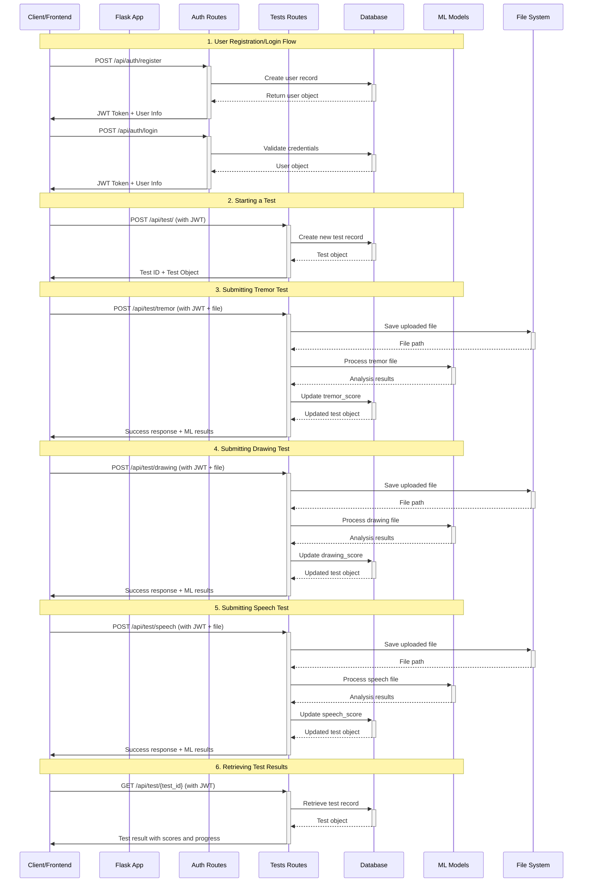

# PD-Server Documentation

## Overview

A server application for Parkinson's Disease detection that processes tremor,
spiral drawing, and voice data through ML models
and manages user authentication and test history.

## Core Functionality

### 1. Authentication System

- User registration and login
- Session management
- Authorization for API endpoints

### 2. ML Model Processing

Processes three types of diagnostic tests:

- **Tremor Analysis**: Processes sensor data files
- **Drawing Analysis**: Evaluates motor control through drawing patterns
- **Voice Analysis**: Analyzes speech characteristics

### 3. Data Persistence

- Store test results in database
- Maintain user test history
- Link results to user accounts

### 4. Tremor Flow (Deferred Implementation)

Special handling for tremor data collection:

- Tremor module operates independently and uploads collected data
- Server processes files asynchronously
- Results pushed to mobile app (mechanism TBD)
- Requires bidirectional communication strategy

## Architecture Considerations

### Test Invocation Models

Implement a unified completion endpoint:

- Tests don't return immediate results
- Mobile app polls `GET /api/test/:id` after test completion
- Consistent pattern across all test types

## API Specification

### Authentication

```
POST /api/auth/register
POST /api/auth/login
```

### Test Submission

```
POST /api/test/tremor
Content-Type: multipart/form-data
Body: text files containing sensor data

POST /api/test/drawing
Content-Type: multipart/form-data
Body: image files

POST /api/test/speech
Content-Type: multipart/form-data
Body: audio files (mp3)
```

### Data Retrieval

```
GET /api/history
Returns: List of all tests for authenticated user

GET /api/test/:id
Returns: Detailed results for specific test
```

## App Sequence Diagram



## Utility Scripts

Scripts are located in the `scripts/` directory.

### Clear Test Data

Delete all test data (TestGroups, TestSessions, TestInputs):

```bash
# Clear database only
python scripts/clear_test_data.py

# Clear database AND uploads folder
python scripts/clear_test_data.py --all
```

**Docker:**

```bash
docker compose exec app python scripts/clear_test_data.py
docker compose exec app python scripts/clear_test_data.py --all
```

### Cleanup Expired Inputs

Delete expired test inputs and their associated files:

```bash
# Preview what would be deleted (dry run)
python scripts/cleanup_expired_inputs.py

# Actually delete expired inputs
python scripts/cleanup_expired_inputs.py --run
```

**Docker:**

```bash
docker compose exec app python scripts/cleanup_expired_inputs.py
docker compose exec app python scripts/cleanup_expired_inputs.py --run
```

### Generate Factory Key

Generate factory API keys for ESP32 device provisioning:

```bash
python scripts/generate_factory_key.py <mac_address>

# Example
python scripts/generate_factory_key.py AA:BB:CC:DD:EE:FF
```

**Docker:**

```bash
docker compose exec app python scripts/generate_factory_key.py AA:BB:CC:DD:EE:FF
```
